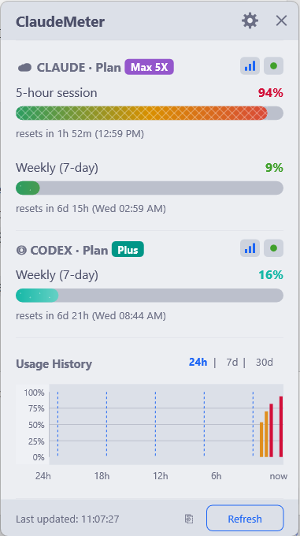

# ⚡ ClaudeMeter

> [English](README.md) · **Español** · [Português](README.pt-BR.md) · [Deutsch](README.de.md) · [Français](README.fr.md)

**Monitor de uso de Claude AI en tiempo real para Windows y macOS.** Consulta los límites de tu suscripción desde la bandeja del sistema o la barra de menús.

ClaudeMeter es una aplicación ultraligera escrita en Rust. Muestra el uso de la sesión de 5 horas, los límites semanales y las cuotas de Sonnet y Opus, sin abrir el navegador.

[Sitio web](https://klivak.github.io/claude-meter/) · [Descargas](https://github.com/klivak/claudemeter/releases/latest) · [Código fuente](https://github.com/klivak/claudemeter)



## Inicio rápido

1. Instala [Claude Code](https://claude.ai/download) e inicia sesión ejecutando `claude` una vez.
2. Descarga ClaudeMeter desde la página de [releases](https://github.com/klivak/claudemeter/releases/latest).
3. En Windows, ejecuta `claudemeter.exe`; en macOS, descomprime `ClaudeMeter-macos-arm64.app.zip` y mueve la app a `/Applications`.
4. Busca el icono en la bandeja del sistema de Windows o en la barra de menús de macOS.

No requiere configuración: detecta automáticamente tu plan y comienza a monitorizarlo.

## Funciones principales

- Límites de Claude: sesión de 5 horas, límite semanal, Sonnet, Opus y nuevas métricas disponibles.
- Panel opcional de Codex, leído localmente de los registros de `~/.codex`.
- Icono dinámico de bandeja: porcentaje, anillo, barra o gráfico circular, con colores según el nivel de uso.
- Panel con modos minimalista, estándar y detallado; historial de 24 horas, 7 días y 30 días.
- Cuatro temas: Auto, Claro, Oscuro, Midnight y Sunset.
- Alertas configurables, inicio automático, exportación CSV/JSON y widget flotante.
- Interfaz disponible en 40 idiomas.

## Privacidad y autenticación

ClaudeMeter no solicita tu contraseña ni tu clave de API. Reutiliza el token OAuth que Claude Code ya guarda localmente y solo se comunica con `api.anthropic.com` para obtener tus propios datos de uso. No contiene telemetría.

El token se busca en `~/.claude/.credentials.json`, el Administrador de credenciales de Windows o el Llavero de macOS. ClaudeMeter nunca modifica estas credenciales.

## Plataformas

| Plataforma | Distribución recomendada |
|---|---|
| Windows 10/11 | `claudemeter.exe` portátil |
| macOS 12+ (Apple Silicon) | `ClaudeMeter-macos-arm64.app.zip` |

La aplicación es nativa: no incluye Electron, .NET, Java, Python ni Node.js. Su uso típico de memoria es de 3–8 MB.

## Seguridad de las descargas

Los binarios Rust sin firma pueden activar falsos positivos heurísticos del antivirus. Descarga únicamente desde [GitHub Releases](https://github.com/klivak/claudemeter/releases/latest) y compara el hash SHA-256 con el archivo `.sha256` publicado junto al binario:

```powershell
Get-FileHash .\claudemeter.exe -Algorithm SHA256
Get-Content .\claudemeter.exe.sha256
```

## Compilar desde el código fuente

```bash
git clone https://github.com/klivak/claudemeter.git
cd claudemeter
cargo build --release
```

En macOS, ejecuta `sh scripts/build-macos-app.sh` para generar el paquete de aplicación. Consulta el [README en inglés](README.md) para la documentación técnica completa, configuración y preguntas frecuentes.

## Licencia

[MIT](LICENSE): uso personal y comercial permitido.

Claude es una marca de Anthropic. ChatGPT es una marca de OpenAI. ClaudeMeter es un proyecto independiente y no está afiliado oficialmente con ellas.
