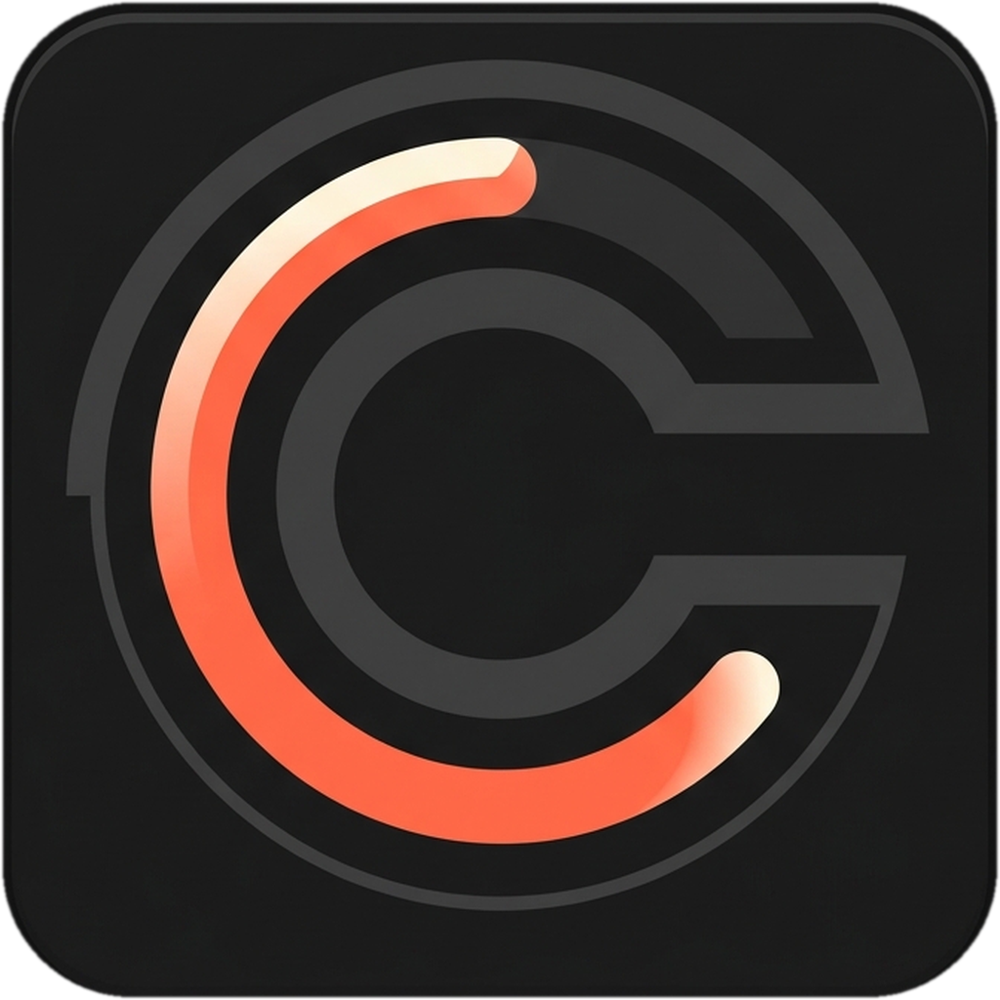
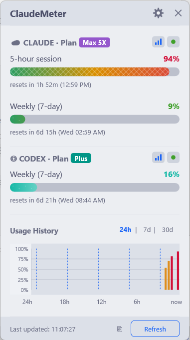
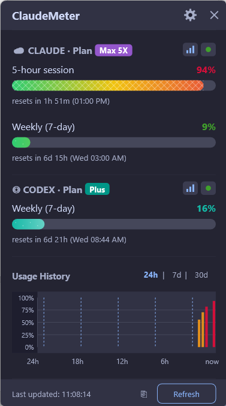
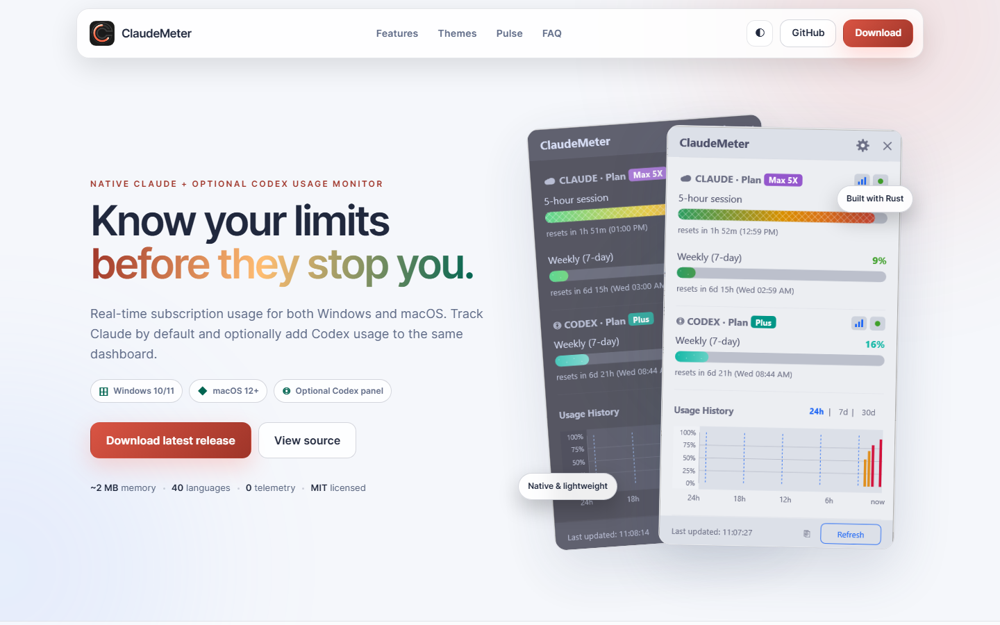
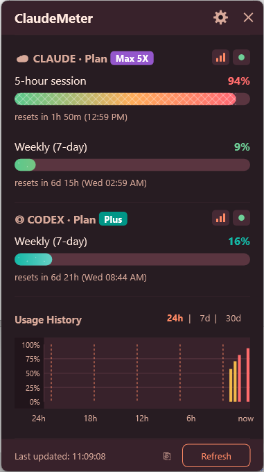
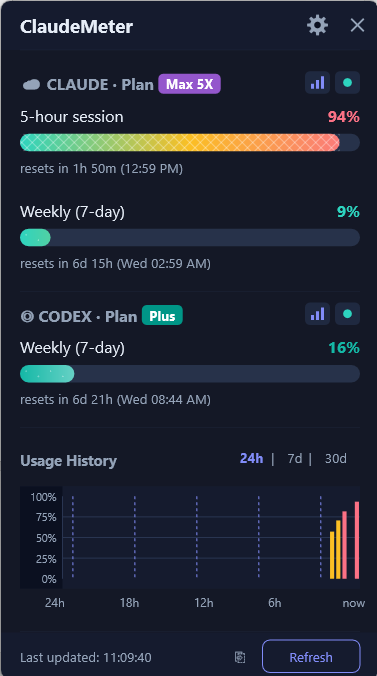
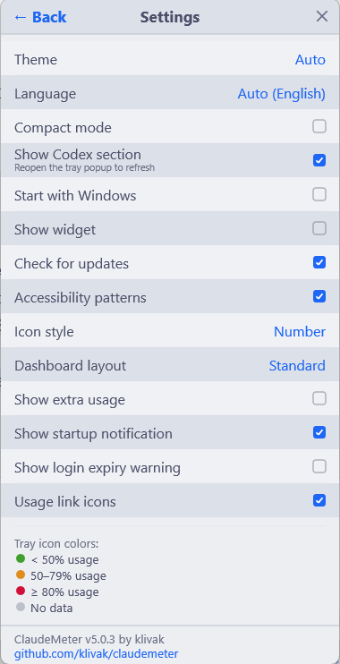

<div align="center">



# ⚡ ClaudeMeter

[](https://ko-fi.com/klivak)

**Real-time Claude AI usage monitor for Windows and macOS — track your subscription limits from the tray or menu bar**

Ultra-lightweight Rust app that monitors Claude Pro & Max usage caps in real time.
See your 5-hour session, weekly limits, Sonnet & Opus quotas — without opening a browser.

**🦀 Purposefully built in Rust — uses under 10 MB RAM. Less than Notepad.**

[](https://github.com/klivak/claudemeter/actions/workflows/build.yml)
[](https://github.com/klivak/claudemeter/actions/workflows/audit.yml)
[](https://github.com/klivak/claudemeter/releases/latest)
[](LICENSE)
[](https://github.com/klivak/claudemeter/releases)
[](https://github.com/klivak/claudemeter/releases)
[](#-why-rust)
[](https://github.com/klivak/claudemeter/releases/latest)

> 🌐 **[Open the ClaudeMeter project website →](https://klivak.github.io/claude-meter/)**<br>
> Explore the dashboard, downloads, themes, Codex support, and live project metrics.

[Website](https://klivak.github.io/claude-meter/) · [Download](#-quick-start) · [Features](#-features) · [Usage](#-how-to-use) · [FAQ](#-faq)

<br>

 

### 📊 Project Pulse

<table>
  <tr>
    <td align="center"><a href="https://hits.sh/github.com/klivak/claude-meter/"></a><br><sub>Approximate page loads</sub></td>
    <td align="center"><a href="https://github.com/klivak/claude-meter"></a><br><sub>Community stars</sub></td>
    <td align="center"><a href="https://github.com/klivak/claude-meter/releases/latest"></a><br><sub>Current stable version</sub></td>
  </tr>
  <tr>
    <td align="center"><a href="https://github.com/klivak/claude-meter/forks"></a><br><sub>Repository forks</sub></td>
    <td align="center"><a href="https://github.com/klivak/claude-meter/issues"></a><br><sub>Reported issues</sub></td>
    <td align="center"><a href="#-languages-40"></a><br><sub>Complete localizations</sub></td>
  </tr>
</table>

**⭐ Finding ClaudeMeter useful? [Star the repository](https://github.com/klivak/claude-meter) — it helps more people discover it.**

<sub>README loads count badge requests since this counter was added, not unique visitors. Caching, bots, repeat visits, and service checks can affect the number. The separate [project website](https://klivak.github.io/claude-meter/) keeps its own long-term page-load history.</sub>

</div>

## 🌐 Project Website

Visit **[klivak.github.io/claude-meter](https://klivak.github.io/claude-meter/)** for a polished, responsive overview of ClaudeMeter:

- Clear **Windows 10/11** and **macOS 12+** support with direct release downloads
- Claude usage by default plus the optional **Codex panel** in the same dashboard
- Interactive Light/Dark website appearance and previews of all four app themes
- Live GitHub stars, latest release, open issues, and a separate privacy-friendly page-load history
- Automatic GitHub Pages deployment and daily public-metric refreshes through GitHub Actions

<div align="center">

[](https://klivak.github.io/claude-meter/)

<a href="https://klivak.github.io/claude-meter/"></a>

</div>

---
☕ [Buy me a coffee](https://ko-fi.com/klivak) if this project helped you

---

## 🤔 Why ClaudeMeter?

Tired of hitting Claude AI rate limits mid-conversation? ClaudeMeter sits quietly in your Windows system tray or macOS menu bar and shows you **exactly** how much of your Anthropic subscription quota remains — 5-hour session utilization, weekly usage caps, Sonnet and Opus limits — all without opening a browser tab or checking the Claude dashboard manually.

## 🦀 Why Rust?

ClaudeMeter is **purposefully built in Rust** to be as lightweight as physically possible. While most similar tools use Electron (which bundles an entire Chromium browser) or Python (which needs a runtime), ClaudeMeter compiles to native Windows and macOS binaries with no bundled browser runtime.

| App | RAM Usage | Binary Size | Dependencies |
|-----|-----------|-------------|-------------|
| **ClaudeMeter (Rust)** | **~2 MB** | **~3 MB** | **None** |
| Windows Notepad | ~10 MB | built-in | — |
| Electron-based tray apps | 80–150 MB | ~80 MB | Chromium |
| Python-based monitors | 25–45 MB | ~15 MB | Python runtime |
| .NET-based monitors | 15–25 MB | ~1 MB | .NET runtime |


**Single portable `.exe` on Windows** and a native **`.app` bundle on macOS** — no Electron, no .NET, no Java, no Python, no Node.js. Download → run → done.

## ⬇ Quick Start

### Step 1: Install Claude Code (one-time)

ClaudeMeter reads your Claude credentials automatically. You need [Claude Code](https://claude.ai/download) installed and logged in:

```bash
# Install Claude Code (if not already)
# Download from https://claude.ai/download

# Log in (creates OAuth token that ClaudeMeter will use)
claude
```

### Step 2: Download & Run ClaudeMeter

#### Windows

1. **Download** [`claudemeter.exe`](https://github.com/klivak/claudemeter/releases/latest) from Releases
2. **Place** it anywhere — Desktop, tools folder, USB drive (it's portable)
3. **Double-click** to run
4. **Look** for the colored circle icon in your system tray (bottom-right near the clock)

That's it! No configuration needed. ClaudeMeter auto-detects your plan and starts monitoring.

#### macOS

1. **Download** [`ClaudeMeter-macos-arm64.app.zip`](https://github.com/klivak/claudemeter/releases/latest) from Releases
2. **Unzip** it and move `ClaudeMeter.app` to `/Applications`
3. **Open** the app; it appears as a native menu bar item
4. Use the menu for **Refresh Now**, **Open Claude Usage**, **Settings/config**, **Import/Export Config**, **Autostart**, and **Open Logs**

The raw `claudemeter-macos-arm64` binary is also published for CLI/agent use, but the `.app.zip` is the recommended macOS download.

### Step 3 (Optional): Enable Auto-Start

Right-click the tray icon → check ✅ **"Start with Windows"**

On macOS, use the menu bar item → **Enable Autostart**. The app uses a LaunchAgent and starts `ClaudeMeter.app` from `/Applications` when available.

## ✨ Features

### Claude AI Monitoring (Automatic)

| Metric | Description |
|--------|-------------|
| 5-hour session | Rolling session utilization with countdown timer |
| 7-day weekly | Weekly usage cap with reset timer |
| 7-day Sonnet | Sonnet-specific limit (shown if applicable) |
| 7-day Opus | Opus-specific limit (Max plans only) |
| Plan badge | Color-coded badge (Pro/Max/5X/20X) with automatic detection |
| Future metrics | Any new API fields are auto-displayed |

### Codex (Optional)

OpenAI does not provide a public API for checking Codex subscription usage. Instead, ClaudeMeter reads your local `~/.codex` logs to show **live Codex usage** directly in the dashboard — a "CODEX · Plan" header with rolling-window progress bars, rendered in a distinct teal hue so they read as a different provider from Claude's bars. Codex also appears in compact mode, where every row is prefixed with `CLAUDE ·` or `CODEX ·` for clarity. If no local Codex logs are found, the panel falls back to a direct Codex usage link. Enable the panel in Settings; a small hint reminds you to reopen the tray popup so its size refreshes.

### System Tray

- **🔢 Dynamic % icon** — shows actual utilization number (e.g. "42") with color-coded background
- **⭕ Icon styles** — choose between Number (default), Ring (circular progress), Bar (vertical fill), or Pie (multi-metric pie chart) in Settings
- **🟢🟡🔴 Color coding** — green (<50%), yellow (50-79%), red (>=80%), gray (no data) with transparent icon backgrounds
- **💬 Rich tooltip** — hover to see all metrics, reset times, and plan info
- **📋 Context menu** — right-click for refresh, export CSV, settings, links
- **📊 Dashboard** — left-click to open the detailed popup
- **⚠ Blink on critical** — tray icon blinks when usage exceeds 90%
- **Branded application icon** — the executable, File Explorer entry, and Windows balloon notifications use the ClaudeMeter usage-gauge mark


### macOS Menu Bar

- **Native `NSStatusItem`** — shows current Claude usage directly in the macOS menu bar
- **Freshness state** — displays whether data is live, refreshing, cached, stale, or blocked by an API error
- **Manual refresh** — `Refresh Now` forces a new poll instead of relying on cached data
- **Quick actions** — open Claude usage, check for updates, open config, import/export config, toggle autostart, and open logs
- **Portable logs** — writes `claudemeter.log` under `~/Library/Application Support/ClaudeMeter`
- **Agent status file** — writes `status.json` for the menu bar UI under `~/Library/Application Support/ClaudeMeter`

### 📊 Dashboard

- **Dashboard layouts** — three modes: Minimal (single largest metric), Standard (all bars), Detailed (metrics with inline sparkline charts)
- **Gradient progress bars** — full-spectrum green→amber→coral gradient with rate-of-change trend arrows (↑↗→↘↓)
- **Easing animations** — smooth ease-out progress bars with cascading staggered appearance (~60fps)
- **Fade-in animation** — popup appears with accelerating opacity transition
- **Slide animation** — smooth horizontal slide between Dashboard and Settings views
- **24-hour / 7-day / 30-day chart** — usage history with toggleable time ranges, evenly spaced 0–100% Y-axis labels, session reset lines, and hover tooltips
- **Provider-aware compact mode** — compact rows include both Claude and enabled Codex limits with explicit provider prefixes
- **Clickable plan name** — click the plan name in the header to open claude.ai/settings/usage
- **D2D-rendered UI** — custom-drawn gear icon, close button, and checkboxes using Direct2D primitives
- **Keyboard shortcuts** — ESC to close, F5 to refresh
- **Auto-refresh** — automatically polls when data is older than 60 seconds
- **Acrylic backdrop** — Windows 11 translucent blur effect (falls back gracefully on Win10)
- **Segoe UI Variable** — uses Windows 11's variable font with automatic fallback to Segoe UI
- **Show extra usage** — toggle in Settings to show the extra_usage metric in the dashboard (off by default)
- **Usage & status icon buttons** — each section header shows compact "open usage" and "service status" icon buttons; toggle them with the "Usage link icons" setting
- **Notification toggles** — Settings exposes "Show startup notification" (silence the "Running in tray" balloon on launch) and "Show login expiry warning" (silence the `claude login` reminder)
- **One-click updates** — clicking the "Update available" tray balloon downloads the verified Windows release, checks its SHA-256 checksum, and installs it safely after ClaudeMeter exits
- **Actionable error recovery** — expired or missing Claude credentials offer a one-click `claude login` copy action, while transient errors can be retried directly from the dashboard

### 🎨 Themes

- **Dark** — easy on the eyes (Catppuccin Mocha palette)
- **Light** — for bright environments (Catppuccin Latte palette)
- **Midnight** — deep navy surfaces with indigo, teal, and rose accents
- **Sunset** — warm charcoal surfaces with coral and peach accents
- **Auto** (default) — follows your Windows system theme automatically
- **Extensible palettes** — surfaces, accents, thresholds, gradients, DWM chrome, and the mini widget stay synchronized per theme

<table>
  <tr>
    <td align="center"><strong>Light</strong><br></td>
    <td align="center"><strong>Dark</strong><br></td>
  </tr>
  <tr>
    <td align="center"><strong>Sunset</strong><br></td>
    <td align="center"><strong>Midnight</strong><br></td>
  </tr>
</table>

#### Settings



### 🌐 Languages (40)

- 🇬🇧 English (default)
- 🇺🇦 Українська
- 🇪🇸 Español
- 🇩🇪 Deutsch
- 🇫🇷 Français
- 🇵🇹 Português
- 🇮🇹 Italiano
- 🇮🇳 हिन्दी
- 🇹🇷 Türkçe
- 🇳🇱 Nederlands
- 🇵🇱 Polski
- 🇻🇳 Tiếng Việt
- 🇷🇺 Русский
- 🇹🇭 ภาษาไทย
- 🇮🇩 Bahasa Indonesia
- 🇸🇪 Svenska
- 🇨🇿 Čeština
- 🇯🇵 日本語
- 🇰🇷 한국어
- 🇨🇳 简体中文
- 🇧🇬 Български
- 🇬🇷 Ελληνικά
- 🇮🇱 עברית
- 🇲🇾 Bahasa Melayu
- 🇳🇴 Norsk
- 🇸🇦 العربية
- 🇷🇴 Română
- 🇩🇰 Dansk
- 🇫🇮 Suomi
- 🇭🇺 Magyar
- 🇵🇭 Filipino
- 🇧🇩 বাংলা
- 🇮🇷 فارسی
- 🇸🇰 Slovenčina
- 🇷🇸 Српски
- 🇪🇸 Català
- 🇭🇷 Hrvatski
- 🇪🇪 Eesti
- 🇱🇻 Latviešu
- 🇱🇹 Lietuvių

### 🧩 Mini Widget

- **Floating PiP window** — always-on-top 52x28px window showing current usage %
- **Theme-aware colors** — threshold colors follow the selected theme palette and custom color overrides
- **Draggable** — drag anywhere on screen
- **Click to open** — click the widget to open the full dashboard
- **Disabled by default** — enable in Settings → "Show widget"

### ♿ Accessibility

- **Colorblind patterns** — progress bars show pattern overlays: dots (green), diagonal stripes (yellow), cross-hatch (red)
- **Disabled by default** — enable in Settings → "Accessibility patterns"

### 🔄 Auto-Update

- **Checks GitHub Releases** on startup for newer versions
- **Balloon notification** — shows a tray balloon if a new version is available
- **Enabled by default** — toggle in Settings → "Check for updates"

### 🔔 Smart Notifications

- Windows toast notifications at configurable thresholds (50%, 75%, 90% by default)
- **Aggregated alerts** — when multiple thresholds are crossed simultaneously, a single batched notification is shown instead of separate alerts
- **Informative alerts** — shows metric name, current %, exceeded threshold, and reset countdown
- **Sound alerts** — system notification sound (configurable on/off)
- **Notification settings** — enable/disable alerts, sound, and cycle alert presets such as 75% / 90% / 100% in Settings
- **Test notification** — use Settings → "Test notification" to verify the Windows balloon and optional sound
- **Startup notification** — confirmation that ClaudeMeter is running in the tray
- **Branded notification icon** — Windows balloons use the embedded ClaudeMeter app icon instead of a generic placeholder
- **Deduplication** — won't spam; resets when usage drops below threshold


### 📤 Data Export

- **CSV export** — right-click tray → "Export History (CSV)" to save full usage history
- **JSON export** — right-click tray → "Export History (JSON)" to save full usage history as JSON
- **SQLite database** — 30-day rolling history stored next to the .exe

### ⚙ Smart Polling

- **Adaptive interval** — polls every 120–300s normally; tightens to 120–180s in the last 15 minutes before each hour (when limits are about to reset)
- **Randomized timing** — each poll interval is randomly chosen to avoid predictable patterns
- **Idle detection** — pauses API polling when PC is idle for 5+ minutes
- **Exponential backoff** — on API errors, interval doubles (2x, 4x, 8x) up to 10 min cap
- **Rate-limit handling** — graceful 429 response parsing with retry-after
- **Sleep/wake progressive retry** — after resuming from sleep/hibernate, retries at 2s, 5s, 15s, 30s intervals until a successful response
- **Network change detection** — detects when network connectivity is restored and triggers an immediate poll
- **Credential file watcher** — monitors `~/.claude/` for changes and re-polls immediately when credentials are updated
- **Web API fallback** — optional fallback to claude.ai web API when OAuth is unavailable (configure `web_api_session_key` and `web_api_org_id`)
- **Config validation** — sanitizes all values on load (polling interval 30-600s, thresholds 1-100%)

## ⚙ Configuration

`config.json` is auto-created on first launch:

| Platform | Default location |
|----------|------------------|
| Windows | Next to `claudemeter.exe` |
| macOS | `~/Library/Application Support/ClaudeMeter/config.json` |

```json
{
  "version": "1.0.0",
  "polling_interval_seconds": 120,
  "notifications": {
    "enabled": true,
    "thresholds": [50, 75, 90],
    "sound": true
  },
  "autostart": false,
  "compact_mode": false,
  "theme": "auto",
  "language": "auto",
  "show_chatgpt_section": false,
  "show_widget": false,
  "check_updates": true,
  "accessibility_patterns": false,
  "tray_icon_style": "number",
  "dashboard_layout": "standard",
  "show_extra_usage": false,
  "show_usage_links": true,
  "custom_colors": {},
  "quiet_hours": {
    "enabled": false,
    "start": "22:00",
    "end": "08:00"
  },
  "web_api_session_key": null,
  "web_api_org_id": null
}
```

| Field | Default | Range | Description |
|-------|---------|-------|-------------|
| `polling_interval_seconds` | `120` | 30–600 | How often to check usage (validated on load) |
| `notifications.enabled` | `true` | — | Enable/disable toast notifications |
| `notifications.thresholds` | `[50,75,90]` | 1–100 | Usage % levels that trigger alerts; cycle presets in Settings |
| `notifications.sound` | `true` | — | Play system sound with notifications |
| `theme` | `"auto"` | auto/dark/light/midnight/sunset | Color theme |
| `language` | `"auto"` | auto/en/uk/.../lt | UI language (40 languages) |
| `compact_mode` | `false` | — | Compact dashboard layout |
| `show_chatgpt_section` | `false` | — | Show the Codex usage panel (legacy config key retained for compatibility) |
| `autostart` | `false` | — | Start with Windows or macOS LaunchAgent |
| `show_widget` | `false` | — | Show floating mini-widget |
| `check_updates` | `true` | — | Check for updates on startup and offer verified one-click installation |
| `tray_icon_style` | `"number"` | number/ring/bar/pie | Tray icon style: number (%), ring (circular), bar (vertical), pie (multi-metric) |
| `accessibility_patterns` | `false` | — | Colorblind overlay patterns on progress bars |
| `dashboard_layout` | `"standard"` | minimal/standard/detailed | Dashboard layout mode |
| `show_extra_usage` | `false` | — | Show extra_usage metric in dashboard |
| `show_usage_links` | `true` | — | Show usage/status icon buttons in section headers |
| `custom_colors` | `{}` | hex strings | Override theme colors (e.g. `{"green": "#00ff00"}`) |
| `quiet_hours.enabled` | `false` | — | Suppress notifications during quiet hours |
| `quiet_hours.start` | `"22:00"` | HH:MM | Quiet hours start time |
| `quiet_hours.end` | `"08:00"` | HH:MM | Quiet hours end time |
| `web_api_session_key` | `null` | string | Session key for claude.ai web API fallback |
| `web_api_org_id` | `null` | string | Organization ID for claude.ai web API fallback |

## ⌨ Keyboard Shortcuts

| Key | Action |
|-----|--------|
| **ESC** | Close dashboard popup |
| **F5** | Refresh usage data |

## 🔨 Building from Source

### Windows

```bash
git clone https://github.com/klivak/claudemeter.git
cd claudemeter
cargo build --release
# Output: target/release/claudemeter.exe (~3 MB)
```

**Requirements:** Rust 1.75+ and Windows SDK (included with [Visual Studio Build Tools](https://visualstudio.microsoft.com/visual-cpp-build-tools/)).

Enable the repository pre-commit hook to format Rust sources automatically:

```powershell
scripts\install-git-hooks.cmd
```

### macOS

```bash
git clone https://github.com/klivak/claudemeter.git
cd claudemeter
sh scripts/build-macos-app.sh
# Output:
# target/aarch64-apple-darwin/release/ClaudeMeter.app
# target/aarch64-apple-darwin/release/ClaudeMeter-macos-arm64.app.zip
# target/aarch64-apple-darwin/release/claudemeter-macos-arm64
```

**Requirements:** Rust stable, Xcode Command Line Tools, Swift compiler, and macOS 12+.

## 🔑 How Authentication Works

ClaudeMeter does **not** ask for your password or API key. It reuses the OAuth token that [Claude Code](https://claude.ai/download) already stores on your machine.

**Token lookup order:**

| # | Location | Used by |
|---|----------|---------|
| 1 | `~/.claude/.credentials.json` | Claude Code v2.x+ on Windows and macOS |
| 2 | Windows Credential Manager (`Claude Code-credentials`) | Claude Code v1.x on Windows (legacy) |

When you run `claude` and log in via the browser, Claude Code saves an OAuth token to `~/.claude/.credentials.json`. ClaudeMeter reads this file to authenticate with the Anthropic Usage API — no extra setup needed.

**What's stored in the file:**

```json
{
  "claudeAiOauth": {
    "accessToken": "sk-ant-oat01-...",
    "refreshToken": "sk-ant-ort01-...",
    "expiresAt": 1772467364905,
    "subscriptionType": "max"
  }
}
```

ClaudeMeter uses `accessToken` to fetch your usage data and `subscriptionType` to display your plan (Pro/Max). It never modifies this file.

> **Troubleshooting:** If ClaudeMeter shows "Credentials not found", run `claude` in a terminal and log in. Then click Refresh in ClaudeMeter. On macOS, use **Refresh Now** from the menu bar item and check **Open Logs** if the status remains cached or stale.

## ❓ FAQ

**Q: Does it work without Claude Code installed?**
A: ClaudeMeter launches but shows a "Credentials not found" message with a link to claude.ai. You need Claude Code logged in so ClaudeMeter can read the OAuth token from `~/.claude/.credentials.json`.

**Q: How much RAM does it really use?**
A: Typically **3–8 MB**. Built in Rust with native Win32 API — no Electron, no browser engine.

**Q: Is it safe? Does it send my data anywhere?**
A: ClaudeMeter is fully open source. It only communicates with `api.anthropic.com` to fetch YOUR usage data using YOUR existing OAuth token. Zero telemetry. Every release binary is automatically scanned by [VirusTotal](https://www.virustotal.com/) (60+ antivirus engines) — check the scan link in each [release](https://github.com/klivak/claudemeter/releases/latest).

**Q: How does Codex tracking work?**
A: ClaudeMeter reads Codex CLI session logs from `~/.codex`; OpenAI does not expose subscription usage through a public API.

**Q: How do I check my Claude usage limits?**
A: Just run ClaudeMeter — it reads your Claude Code OAuth token and shows all your limits (5-hour session, weekly cap, Sonnet/Opus quotas) in a system tray popup. No manual checking needed.

**Q: Does it work with Claude Pro, Max 5x, and Max 20x plans?**
A: Yes. ClaudeMeter auto-detects your plan tier and displays the correct limits for Pro, Max, Max 5x, and Max 20x subscriptions.

**Q: What is the Claude 5-hour session limit?**
A: Claude enforces a rolling 5-hour usage window. ClaudeMeter shows your current utilization percentage and a countdown to when it resets.

**Q: Can I run ClaudeMeter from a USB drive?**
A: On Windows, yes. It's a single portable `.exe` with zero dependencies. On macOS, use the `.app` bundle for the menu bar UI or the raw `claudemeter-macos-arm64` binary for CLI/agent use.

**Q: Does the macOS version have a real menu bar UI?**
A: Yes. Starting with v4.0.1, ClaudeMeter ships a native AppKit menu bar app with usage %, freshness status, force refresh, Claude link, config import/export, autostart toggle, update check, and log access.

**Q: How do I know if the value is cached?**
A: On macOS, the menu shows freshness state such as Live, seconds/minutes old, cached/no data, refreshing, or API error. On Windows, use the tray refresh/dashboard behavior and settings to force a refresh.

**Q: Does it support multiple languages?**
A: Yes — 40 languages: English, Ukrainian, Spanish, German, French, Portuguese, Italian, Hindi, Turkish, Dutch, Polish, Vietnamese, Russian, Thai, Indonesian, Swedish, Czech, Japanese, Korean, Chinese (Simplified), Bulgarian, Greek, Hebrew, Malay, Norwegian, Arabic, Romanian, Danish, Finnish, Hungarian, Filipino, Bengali, Persian, Slovak, Serbian, Catalan, Croatian, Estonian, Latvian, and Lithuanian.

## 📄 License

[MIT](LICENSE) — free for personal and commercial use.

---

<div align="center">

**🦀 Purposefully built in Rust for minimal footprint and maximum reliability**
**3–8 MB RAM · Single .exe · Zero dependencies · Open source**

Made by [klivak](https://github.com/klivak)

*Claude is a trademark of Anthropic. ChatGPT is a trademark of OpenAI.*
*ClaudeMeter is an independent open-source project with no official affiliation.*

</div>
